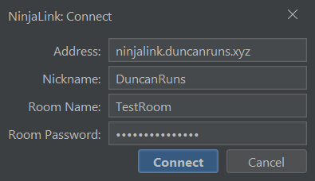

# NinjaLink

A co-op tool to see other player's positions and measured strongholds using Ninjabrain Bot.

## Player Usage

### Installation, configuration, and connecting to a server/room

- If you want other players to be able to see the coordinates from your latest F3+C or see your measured Strongholds,
  you need to have Ninjabrain Bot open with the API enabled. The API can be enabled in the Advanced settings:

- Download the latest version's jar from releases and store it somewhere (ideally in its own folder).
- On Windows, double-click the jar to run it. If this doesn't work, you can try
  running [jarfix](https://johann.loefflmann.net/downloads/jarfix.exe).
- When NinjaLink opens, you will be prompted to connect to a server/room. The default IP is of the public NinjaLink
  server, it is recommended to keep this unchanged. Enter a nickname, room name, and (optionally) a room password to
  join a room. If a room of that name does not already exist, one will be created with the given name and password. If
  you are connecting to a custom server without the rooms feature, the room name and password fields should be left
  blank.

### Usage

- You can press `P` with the window selected to 'pin' the window (always on top).
- You can press the up or down arrow keys to increase/decrease font size.
- With Ninjabrain Bot open, measure a Stronghold as normal, and you should see it appear on NinjaLink, you will also see
  other player's Strongholds appear on NinjaLink.
- Press F3+C at any point for other players to see your coordinates and dimension, and to convert stronghold coordinates
  to your dimension.

## NinjaLink Public Server

As of February 2025, a public NinjaLink server using rooms is available at `ninjalink.duncanruns.xyz`. This is using a
free tier VPS, and will go down by the end of next January, and the server will need to be replaced (IP will likely
not change).

## Hosting a NinjaLink server

Download the latest version's jar from releases and store it somewhere, then open a terminal or command prompt in the
same folder and run `java -jar NinjaLink-<version>.jar server`, replacing `<version>` with the version of the actual
jar. You can also specify a custom port for the NinjaLink server, for example
`java -jar NinjaLink-<version>.jar server 8888`. The default port is `52534`.

By default, your hosted server will not have rooms, and will have a single default room that every user will be
redirected to. You can host a rooms server by adding the `rooms` argument, for example
`java -jar NinjaLink-<version>.jar server default rooms` (`default` meaning default port).