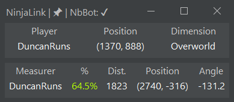

# NinjaLink

A coop tool to see other player's positions and measured strongholds using Ninjabrain Bot.

## Player Usage

### Installation, configuration, and connecting to a server

- If you want other players to be able to see the coordinates from your latest F3+C or see your measured Strongholds,
  you need to have Ninjabrain Bot open with the API enabled. The API can be enabled in the Advanced settings:

- Download the latest version's jar from releases and store it somewhere (ideally in its own folder).
- On Windows, double-click the jar to run it. If this doesn't work, you can try
  running [jarfix](https://johann.loefflmann.net/downloads/jarfix.exe).
- Once open, input the IP of the NinjaLink Server, then input your name, and it will then attempt to connect.

### Usage

- You can press `P` with the window selected to 'pin' the window (always on top).
- With Ninjabrain Bot open, measure a Stronghold as normal, and you should see it appear on NinjaLink, you will also see
  other player's Strongholds appear on NinjaLink.
- Press F3+C at any point for other players to see your coordinates and dimension, and to update your distances and
  angles to the measured Strongholds.

## Hosting a NinjaLink server

Download the latest version's jar from releases and store it somewhere, then open a terminal or command prompt in the
same folder and run `java -jar NinjaLink-<version>.jar server`, replacing `<version>` with the version of the actual
jar. You can also specify a custom port for the NinjaLink server, for example
`java -jar NinjaLink-<version>.jar server 8888`. The default port is `52534`.